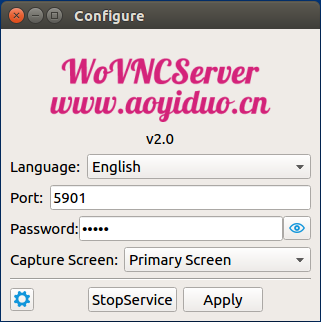
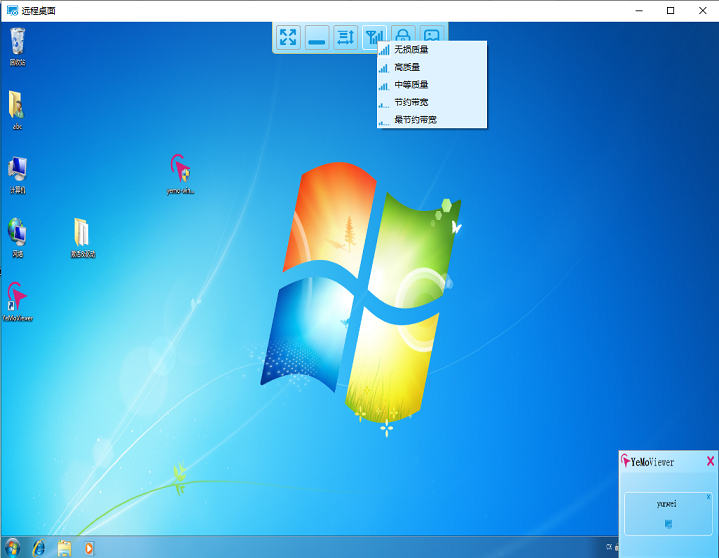
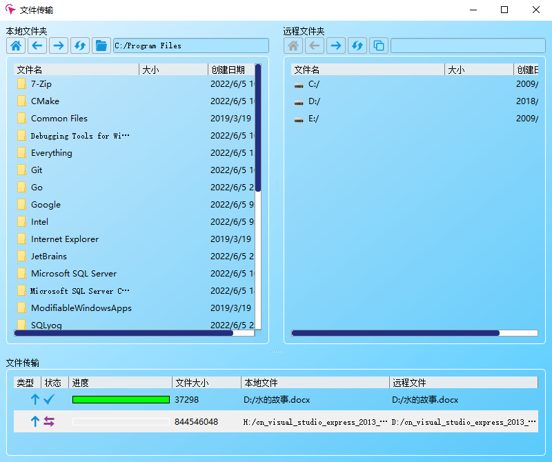

# Overview
VNC Server & Client base on Qt 5.

This project is licensed under the terms of the [GPLv3](https://www.gnu.org/licenses/gpl-3.0.en.html) or any later version. See the LICENSE file for the full text of the license.

The main goal of this project is to provide a easy mult-platform tool.

## Feature
- There is no limit on the number of users logging in at the same time.
- Support the standard rfb3.8 protocol, support the standard raw / copyrect /hexile / trle / zrle / openh264 encoding, and expand the zrle2/trle2/trle3/zrle3 encoding to make it have a higher compression ratio.
- Support the private screen feather.
- Support window / linux / macosx, and android / ios in future

## WoTerm
The woterm client full support the feature list above

download the binary program [http://woterm.com](http://woterm.com)
## Details: 
<a href="http://www.wovnc.com">http://www.wovnc.com</a>

## Binary Program:
<a href="http://wovnc.com">http://wovnc.com</a>

## Ui Preview

